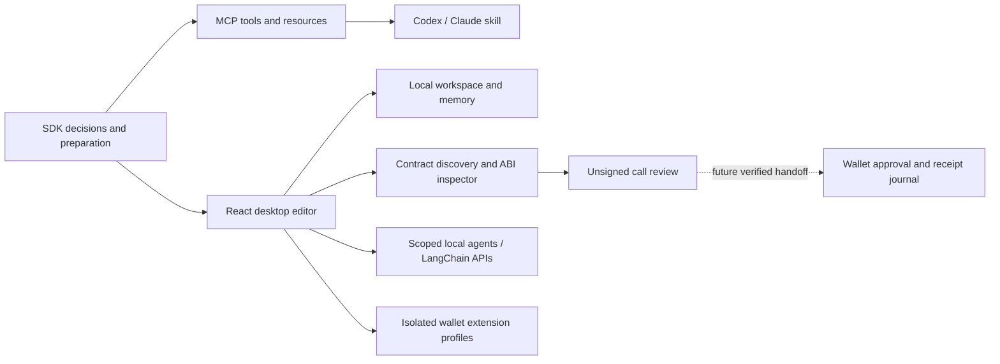

# KEEL engine readiness — 2026-09-07

The SDK, MCP, skill and desktop now share a creator decision catalog. A native
Electron editor is implemented and ready for local hands-on testing with a
separate practice workspace, local catalog and simulated contract. This audit distinguishes
working local preparation from authenticated integrations, wallet capability
and selected-chain publication. It does not certify the entire protocol or call
the engine production complete.

## Product structure

The project is the durable unit of work. It contains creator files and explicit
release intent, and links to objects, reusable modules, collections and contracts.
The editor uses the Studio's fonts/colors and React/Tailwind stack; its backend
is a local tRPC service over restricted IPC instead of a remote Next.js server.

## Shared decisions and defaults

`@keel/sdk/engine` is browser safe and authoritative for the editor's capability
catalog and missing-question planner. MCP exposes it as `keel-engine-catalog`,
`keel-project-decisions`, and `keel://mcp/engine`. The agent skill consumes that
resource instead of inventing a parallel set of rules.

| Decision | Selected default / question rule |
| --- | --- |
| New local project | Explore locally with editable HTML; no wallet or chain required |
| Creator choice already supplied | Preserve it; never silently replace chain family or storage mode |
| Missing release decisions | Show suggestions and ask at most three unresolved questions; suggestions are not saved selections |
| Collection | Suggest dedicated ERC-721A for new unique works; dedicated/shared ERC-1155, standard ERC-721 and existing/custom contracts remain explicit choices |
| Limited supply | Positive decimal integer is required; fixed an intake bug that previously emitted an unlimited supply |
| Mint system | Admin mint, MintGate campaign, OneMint phased drop and Fray auction are distinct |
| Storage | Inline/native/hybrid/IPFS/Wake stay distinct; no automatic fallback to another storage mode |
| Asset delivery | Auto selects Inline through 1,750,000 measured Gzip bytes, then RPC reconstruction; an explicit delivery choice is preserved |
| Publication shell | Registered canonical shell by default, with an explicit direct-display switch; local preview does not establish publication readiness |
| Target network | Explicit EVM or Tezos RPC and checked chain identity; no automatic use of another chain's contracts |
| Contract authority | Unverified until a chain/account/action-specific authority check; ABI, names and stored records cannot grant it |
| Assistant | Local Codex default; named chats and archives; relevant saved context starts on and is inspectable; workspace access can be disabled per chat |
| Wallet installation | Official browser source for normal use; in-app unpacked extension installation is experimental |

The catalog includes runtime routes for media/HTML/p5/Three/Doom/Flash, mint gate
combination semantics, signatures, OneMint's supported stages, Fray presets,
library reuse policies and module setup commands. Unsupported routes are
reported as unavailable, not mapped to a vaguely similar mint contract.

Mint eligibility, collection administration, library access/licensing, platform
draft authorization and wallet delegation are separate permission domains.
An access gate does not make public onchain bytes private. A remembered public
wallet address is watch-only. An MCP installation does not install its skill,
and a skill installation does not configure/authenticate an MCP server.

## Contract and collection model

`@keel/sdk/contract-controls` supplies stable chain/address identities, bounded
ABI parsing and exact calldata generation. The desktop's registry accepts
default, collection, standalone, custom, proxy and implementation records.
Function overloads remain distinct and uint values retain decimal precision.
Write preparation targets the proxy address, not the implementation.

Creator factory discovery reads the explicit chain/factory/creator at one
block, validates directory counts and creator membership, and imports up to
100 collections. Dedicated ERC-721A/ERC-721/ERC-1155 and shared ERC-1155 get
their generated ABI; external contracts require the creator's ABI. The
factory and renderer appear as related infrastructure. Two logical collections
on a shared ERC-1155 remain separate collection records. Factory membership is
not proof of current ownership, current roles or authenticated factory identity.

Proxy inspection observes EIP-1967 implementation/admin/beacon slots and the
standard minimal-clone form. Beacon resolution uses the same block. Changed
implementations and absent code are surfaced. Custom proxy layouts, diamonds,
explorer verification and continuous upgrade monitoring remain outstanding.
The UI cannot infer semantic authorization for an arbitrary ABI method.

## Asset import, shell and live networks

The desktop preserves any regular file through streamed, content-addressed
storage. File type and the old 976 KB editor limit do not reject an import.
Small text files can become editable source; binary and larger files become
project objects. Unknown formats remain available for exact original export
even when a suitable display module is needed. Source editing, portable backup
and local preview each have their own resource limits; those are separate from
file acceptance. Large originals can be exported individually without a JSON
backup's size limit.

The Shell area selects canonical verification or explicit direct display,
the displayed project/object, and Auto/Inline/RPC delivery. Original and Gzip
sizes are measured from the preserved bytes. The inclusive 1.75 MB rule is a
delivery default, not a claim that every collector supports the result. Complete
URI overhead, reader response limits and actual presentation read gas still need
checks. Warnings explain the current 2 MB reader budget, the smaller of the
selected block gas limit and KEEL's 60M presentation policy, and RPC dependency
for reconstruction. Endpoint-specific call limits may be lower and require an
exact read. Local preview and a prepared delivery plan do not publish an object.

Direct contract guidance distinguishes `haulObject(bytes32)` for uncompressed
objects from `readSlug(bytes32,uint256)` for paged stored bytes. Compressed
objects require joining those bytes, applying the declared decompression and
verifying the original hash/length. The UI does not claim the contract can
decompress Gzip in one call. A separate uncompressed object can supply that
single-call route, subject to read limits and reviewed extra publication cost.

`@keel/sdk/network-inspection`, MCP's `keel-network-inspect` and the editor use
the same live inspection. Custom EVM networks are selected by RPC and checked
chain ID; Tezos uses its own chain identity, limits and storage units. Local
network profiles encrypt RPC configuration and exclude it from portable project
exports and assistant context. The open network panel refreshes every 20 seconds
and supports manual refresh. Failed refreshes do not present an old quote as live.

EVM inspection reads the current block, fees and code at recorded or supplied
KEEL addresses. Missing catalog records require lookup/setup; they do not prove
that no deployment exists. Code presence remains identity-unverified. Exact
prepared calls can be estimated at the observed block, with publication cost
separate from presentation read gas. Editing a call clears its previous estimate.
Quotes exclude transaction value, separate transactions and extra chain charges
such as rollup L1 data fees. Tezos limits are reported separately; a complete
Tezos fee quote still requires operation simulation. Connecting an arbitrary
network does not install KEEL contracts or certify that chain's mint workflows.

## Integration evidence

| Surface | Implemented and locally checked | Remaining proof / feature work |
| --- | --- | --- |
| SDK | Shared catalog/planner, browser-safe exports, ABI controls, bounded exact arguments, supply validation and measured asset delivery policy | Full chain-specific mint/permission integration matrix and external contract adapters |
| MCP | 33 tools including shared engine/ABI/network inspection, five resources, protocol negotiation, CLI self-test and strict transport tests | Authenticated Studio routes, real Codex/Claude client discovery sessions and release packaging |
| Skill | Shared decision routing, contract/proxy distinctions, permissions, module setup, live network inspection and asset/direct-read guidance | End-to-end evaluated creator conversations in both clients |
| Editor | React/Studio styling, streamed file import, canonical shell and direct display, isolated previews, attached objects, public identities, explicit memory and preserving export/import | Full code editor/language services, multi-window conflict reconciliation and source control |
| Networks | Custom RPC profiles, checked identity, live refresh, deployment lookup states and exact EVM gas estimates; real Sepolia read plus EVM/Tezos fixtures | Real Tezos operation simulation, endpoint-specific presentation limits, contract identity and full chain-specific publication estimates |
| Contracts | Factory discovery, pinned-block reads/proxy checks, ABI controls and unsigned simulation exercised with local fixtures | Actual selected-chain owner/roles/code identity, wallet receipt and recovery verification |
| Providers | Real Codex tool execution and read-back; LangChain API/tool loop; scoped Claude MCP; persistent chats, streaming, archive/restore, context manifests, editable memory and guarded edit/wallet reviews | Expired Claude OAuth session needs sign-in; direct API account acceptance |
| Wallets | Pinned MetaMask/Rabby/Temple packages; native EVM bridge and rejection/isolation checks; MetaMask unlock/connect/signature/local-transfer receipt proof; Beacon chooser and Tezos account/network/receipt tests | Each external Tezos wallet approval flow, hardware/recovery/update coverage, Windows/Linux certification |

The preceding SDK/MCP feature pass completed all 680 checks with the standard
`pnpm test` build-and-test command, bounded concurrency and no skipped tests.
The desktop optimization pass builds successfully and passes 46 desktop tests,
and the expanded native test passes through editor save/restart, a GIF larger
than 2 MB with verified shell display and exact original export, explicit shell
bypass, encrypted custom network profiles, live fee refresh and exact gas
estimation. It also checks local ES modules and fetches, external
and cross-project fetch denial, ABI import/read/simulation, stale-result clearing,
Studio capability negotiation, shared MCP search, module reference persistence,
workspace export/import and extension profile restart. Screenshots and native
evidence are in `apps/desktop/artifacts/smoke-report.json`.

The optimization pass also verifies background preview assembly, bounded cache
reuse, immutable workspace snapshots, other-writer/rollback detection, duplicate
save protection, continued editing during a pending save, and discarded late
contract/gas responses. Dismissed backup reviews release their retained data.
See [desktop performance evidence](../apps/desktop/PERFORMANCE.md) for measured
before/after results and the exact workload.

The artist workflow adds metadata-image project cards, a metadata form with
full JSON and typed traits, optional source editing, phone/desktop/focus previews,
and a release wizard driven by the SDK catalog. Project management links shared
contracts, storage/files, release plans and reusable resources. Metadata import,
export, custom fields and check history survive native restart. Responsive artist
screens were checked at 1512 px and 1000 px with no horizontal overflow.

Metadata checks use actual local SHA-256 reads and pinned EVM `tokenURI` / `uri`
responses, including ERC-1155 substitution and comparison with the saved draft.
They record observations and unanswered checks rather than issuing a universal
onchain score. Tezos metadata, complete dependency/immutability audits, real
analytics, index publication and wallet-backed updates remain explicit gaps.
A configured Studio search reports candidates and exact local fingerprint matches;
it cannot certify ownership or a public gallery listing. The practice service
now supplies a labelled metadata token so the read-back path can be tested locally.

A read-only query to the public Sepolia RPC verified chain 11155111 at block
11657698 on September 7, 2026 (Denver time), including current fees, the 60M
block gas limit and code presence at the recorded KeelHold address. The result
is a point-in-time observation, not a standing fee quote or contract identity
certification. See `apps/desktop/artifacts/live-network-report.json`.

The installed Codex CLI passed both its advisory protocol handshake and a real
minimal connection request; no project or wallet data was sent. The initial
mock-only adapter had quoted config-path segments incorrectly, which failed
against the real CLI; the corrected connection was exercised successfully.
Claude Code is installed but signed out, so its connection is not ready until
the user signs in. Direct OpenAI/Anthropic API accounts are not verified here.
No deployment, chain transaction or real wallet installation was performed.

The practice launcher supplies a loopback Studio/RPC fixture and a visibly
labeled sample contract. Fixture responses are not selected-chain proof.
The fixture rejects transaction submission and closes with its editor.
See [hands-on test instructions](../apps/desktop/TESTING.md).

## Wallet extension architecture and release gate

Electron's official API supports unpacked extensions and a subset of Chrome
APIs; extensions must be reloaded into persistent sessions on every start.
There is no native arbitrary Chrome Web Store/CRX compatibility guarantee.
[Electron extension API](https://www.electronjs.org/docs/latest/api/extensions).

KEEL stages a private copy, shows requested permissions and a SHA-256 package
fingerprint, then requires explicit installation of those bytes. Symlinks,
unsafe paths and oversized packages are rejected. Startup rechecks integrity;
changed packages are blocked while vault profiles are preserved. The editor,
preview and each installed extension use separate execution boundaries. No
extension gets the editor preload. Disable never clears wallet storage.

Before labeling a wallet supported, certify a pinned version on every shipped
OS: install/update/rollback, background lifecycle, unlock/relock, account and
chain changes, permission revocation, fresh test-wallet recovery, popup/tab
flows, cancellation, rejected requests, signing and receipt reconciliation.
Do not use real funds as a compatibility test.

The implemented EVM bridge uses a dedicated local HTTPS connection page inside
each wallet's session. It discovers EIP-6963 providers and permits only typed
EIP-1193 operations. A one-use review binds account, chain, proxy/code identity,
target, arguments, native value and expiry. Simulation runs before approval;
submission state persists before sending. Receipt checks compare actual calldata
and value with the review and recheck canonical inclusion. Unknown outcomes are
never replayed. Preview content and assistant runtimes have no wallet provider or
signing IPC capability.

Tezos uses a separately bundled Beacon client in an isolated local wallet page.
Temple can pair from its installed extension session; Kukai opens in a separate
wallet window, while Umami and supported mobile wallets use explicit app links
or QR. Network profiles are checked against exact Tezos chain hashes. Public
keys must derive the shared address. Message checks use packed Micheline and
verify the signature. Tezos transactions have their own simulation, fee/storage
burn estimate, one-use review, persisted submission and receipt matching. Tests
cover chain/account changes, rejected/unknown outcomes, extra transaction
rejection and reorganization handling. The native chooser passes without browser
errors; actual approval and operation acceptance through each named external
Tezos wallet remains a release gate.

Community browser-shell projects can supply additional extension APIs and
store integration, but `electron-chrome-extensions` uses GPL-3.0 or a separate
commercial license. No such dependency or license purchase was added.
[Browser-shell licensing](https://github.com/samuelmaddock/electron-browser-shell/blob/master/LICENSE).

## Remaining implementation order

1. Finish Claude sign-in and direct API account acceptance, evaluate creator
   conversations with both skills/clients, and add explicit proposed-edit application.
2. Extend saved Studio module references into exact dependency locks with
   selected-chain policy commitments and receipt/read-back status. Capability
   discovery, live search and reference persistence are implemented.
3. Extend current-role and code identity checks and the existing durable
   creator-operation recovery journal to each supported mint workflow. Cover
   all collection kinds, multi-contract proxies and selected-chain permissions.
4. Extend named wallet acceptance across all shipped platforms, external Tezos
   apps, hardware wallets, recovery and curated update/rollback. The narrow EVM
   approval broker and Beacon handoffs are implemented; keep their proof levels
   explicit until each complete wallet/version flow is exercised.
5. Extend backup/import with migration tooling and recovery UI, structured source edits,
   undo/history, richer editor tooling and signed/notarized platform installers
   with reviewed update provenance. Run independent security and user acceptance
   review before presenting the app as ready for ordinary creators with funds.

## Primary integration references

- [Codex app-server protocol](https://developers.openai.com/codex/app-server)
- [Codex configuration](https://developers.openai.com/codex/config-reference)
- [Claude Code headless integration](https://code.claude.com/docs/en/headless)
- [MCP lifecycle/version negotiation](https://modelcontextprotocol.io/specification/2025-06-18/basic/lifecycle)
- [Electron security](https://www.electronjs.org/docs/latest/tutorial/security)
- [EIP-1967 proxy slots](https://eips.ethereum.org/EIPS/eip-1967)

Local build success is a hard prerequisite for any eventual managed-site or
remote-image rollout. This work has no remote release action.

The expanded desktop chat harness and its current evidence are documented in
[desktop agent workspace](../apps/desktop/AGENT_WORKSPACE.md). New native tests use a separate
fixture provider; live Codex acceptance uses a disposable workspace, never user wallets.
